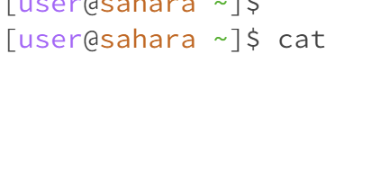

#1. When entering cd with no arguments provided, nothing is outputted. The working directory was the home directory, or /home. However, upon further testing, using cd from a working directory that wasn't the home directory changed the working directory back to the home. So, entering cd with no arguments returns the directory back to the home, which seems like a reasonable and intended purpose of the command (not an error).

#2. When entering cd with a directory provided, the working directory of the user is changed to the argument. Before running the command, the working directory was /home, but it was changed to /home/lecture1 after. Here, the subdirectory is shown after the green tilde to indicate the new working directory. Since this is exactly what cd was designed to do, the output was not an error.

#3. When entering cd with a file provided, an error message saying the given file is not a directory is returned. The working directory was the home directory, and test.java was a file in that directory, but since you can't change directories to a file, an autogenerated error message was provided.

#4. When entering ls with no arguments provided, all of the files in the current working directory are printed. Since the working directory was the home directory, "lecture1", "test.java", and "URIMain.class" were outputted, with lecture1 in blue text. This is because these were the directories and files at that directory level. This seems like the intended purpose of the function.

#5. When entering ls with a directory provided, all of the files in that directory are printed. Here, the working directory was the home directory both before and after running the command, even though another directory was accessed to print the files. Just like before, the files "Hello.class", "Hello.java", and "README" are outputted in black text to denote they are files, while "messages" is outputted in blue to signify it is a directory. This seems like the intended purpose of the function. 

#6. When entering ls with a file provided, the filename is returned. Here, the working directory is the home directory, and the argument being used is test.java. This was probably outputted so that running the function with a file didn't cause an error. 

 

#7. When entering cat with no arguments provided, the terminal at first appears to go blank, since a new line for entering commands is not immediately provided. Upon experimenting, however, it becomes clear that the terminal starts returning whatever the user types; for example, typing in asdf returns asdf. The working directory is the home directory. This may be because cat typically prints out the contents of a file. Since no file was provided, the command ends up printing what data the user provides instead. This behavior is not an error, as it just reads inputs from the terminal and then writes them to the terminal (which makes sense if no argument is provided).

#8. When entering cat with a directory provided, an error message saying the argument is a directory is printed. The working directory is the home directory. Since cat prints the contents of files, the command doesn't know what to print for the directory (printing the contents of the directory is redundant since ls already accomplishes that). So, the error message is printed.

#9. When entering cat with a file provided, all of the contents of the file are printed. The working directory is the home directory. Since this is the intended function of cat, this is probably not an error.
