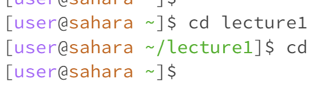

1. When entering cd with no arguments provided, nothing is outputted. The working directory was /home. However, upon further testing, 

2. When entering cd with a directory provided, the working directory of the user is changed to the argument. Before running the command, the working directory was /home, but it was changed to /home/lecture1 after. Here, the subdirectory is shown after the green tilde (note the root directory /home is not shown)  to indicate the new working directory. Since this is exactly what cd was designed to do, the output was not an error.

3. 

4.

5.

6.

7.

8.

9.
