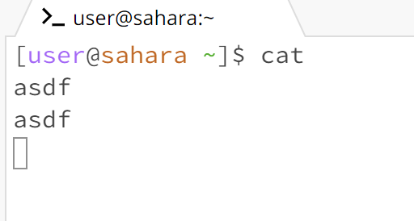

1. When entering cd with no arguments provided, nothing is outputted. The working directory was /home. Since cd changes the terminal to a different directory, it is necessary to provide a directory to change to and not providing any argument means nothing happens. This was probably the intended function of that command and not an error.

2. When entering cd with a directory provided, the working directory of the user is changed to the argument. Before running the command, the working directory was /home, but it was changed to /home/lecture1 after. Here, the subdirectory is shown after the green tilde (note the root directory /home is not shown)  to indicate the new working directory. Since this is exactly what cd was designed to do, the output was not an error.
3. 
